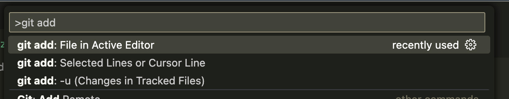
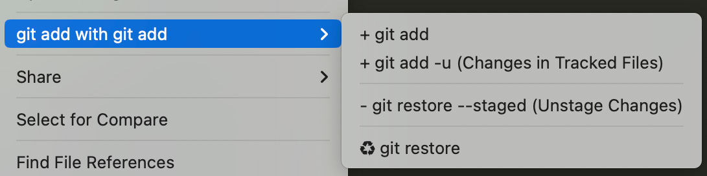

<a href="https://tettekete.github.io/vscode-git-add-with-git-add-extension/">English</a> / 日本語

**目次:**

- [git add with git add](#git-add-with-git-add)
	- [コマンドパレットからの操作](#コマンドパレットからの操作)
		- [使い方](#使い方)
		- [コマンドと実行内容](#コマンドと実行内容)
	- [エクスプローラー上のコンテキストメニュー](#エクスプローラー上のコンテキストメニュー)
	- [git 追跡状況をステータスバーに表示する](#git-追跡状況をステータスバーに表示する)
		- [設定方法:](#設定方法)
		- [表示フォーマット](#表示フォーマット)
		- [注意点](#注意点)
- [動機](#動機)
- [必要環境](#必要環境)

# git add with git add

VSCode で `git add` を行うにはコマンドパレットで `git stage changes` とタイプする必要があります。

この機能拡張はコマンドパレット上から  `git add` と入力して `git add` コマンドを実行する機能を提供します。

またエクスプローラー上のコンテキストメニューから `git add` や `git add -u` の他、`git restore --staged`(アンステージ)などを行う事が出来ます。

## コマンドパレットからの操作

コマンドパレットから `git add` と入力し、サジェストされた `git add: File in Active Editor` を選ぶことで、現在アクティブとなっているファイルを `git add` します。

同じように `git add` と入力してサジェストされる `git add: Selected Lines or Cursor Line` を選ぶと、選択範囲またはカーソル位置の行を `git add` することが出来ます。

`git add: -u (Update Tracked Files)` で追跡中の更新があったファイルを全て `git add` することも出来ます。

### 使い方

1. コマンドパレットを開きます
   - mac: `cmd` + `shift` + `p`
   - windows: `ctrl` + `shift` + `p`
2. `git add` と入力すれば `git add: File in Active Editor` がサジェストされるので選択してください
   - `git add -u` と入力すれば `git add: -u (Update Tracked Files)` がサジェストされます
3. サジェストされたコマンドを実行すれば現在アクティブなファイルが `git add` されます

### コマンドと実行内容

- **`git add: File in Active Editor`**:

	アクティブウィンドウのファイルが `git add` されます

- **`git add: Selected Lines or Cursor Line`**:

	アクティブウィンドウの選択された行が `git add` のインタラクティブモードで行を選択した時のように `git add` されます（正確には `git apply --cached` を利用しています）

- **`git add: -u (Update Tracked Files)`**:

	`git` 追跡中で更新のあるファイルが `git add` されます。つまり `git add -u` が実行されます。

## エクスプローラー上のコンテキストメニュー

エクスプローラー上のコンテキストメニューからファイルやフォルダに対して以下のコマンドが実行出来ます。

- `git add`
- `git add -u`
- `git restore --staged`
- `git restore`

複数のファイルを選択している場合、選択されたアイテムの上でコンテキストメニューを開いてください。
エクスプローラー下部の空白部分からコンテキストメニューを開いた場合ワークスペースフォルダ全体が対象となりますのでご注意ください。

## git 追跡状況をステータスバーに表示する

ステータスバーにアクティブエディタで表示しているファイルの git 追跡状況とファイルパスなどを表示することが出来ます。

VSCode のエクスプローラーはファイルの一部がステージングされたファイルであっても `M` 表示のままで分かりにくいためこの機能を実装しました（もちろん VSCode 標準の「ソースコントロール」を毎回表示する人には不要な機能です）。

### 設定方法:

1. 「設定」を開く
   - 「設定」→「拡張機能」→「git add with git add」→「ファイルステータスをステータスバーに表示する」
   - 若しくは「設定」から `git-add-with-git-add.showFileStatusInStatusBar` を検索する
1. 「ステータスメッセージとして表示する」か「ステータスバーアイテムとして常時表示する」を選択する

「ステータスバーアイテムとして常時表示する」を選んだ場合、ステータスバーに常駐します。
「ステータスメッセージとして表示する」を選んだ場合他のステータスメッセージで上書きされる場合があります。

### 表示フォーマット

「設定」の「ファイルステータスの表示フォーマット」で表示フォーマットを指定する事ができます。
コンフィグを検索する場合は `git-add-with-git-add.fileStatusFormat` で検索してください。

デフォルトは `${git_short_stat} : ${rel_path}` です。

以下、使用可能なプレースフォルダとその説明です。

| プレースフォルダ | 内容 |
|---------------|------|
| `${abs_path}` | ファイルの絶対パス	|
| `${rel_path}` | ワークスペースフォルダからの相対パス	|
| `${file}` | ファイル名	|
| `${git_stat}` | `Added` ,`Modified`,`Modified+Added` 等のロングスタイルのステータス表記 |
| `${git_short_stat}` |	`A`,`M`,`M+A` といったショートスタイルのステータス |

### 注意点

「git add with git add」が提供する git コマンドの結果は即座に反映されますが、それ以外の方法で追跡状況に変更が加えられた場合は若干遅れて更新されます。デフォルトでは最大 3 秒遅れて更新されます。反映速度を上げたい場合は「設定」から「git status の監視間隔（秒）」を短くすることも出来ます。

設定上は 1 秒以下の設定も可能ですが、VSCode のパフォーマンスへの影響を考慮し、内部的に 0.3 秒以下には出来ない様になっています。

# 動機

- [“Where is `git add` in Visual Studio Code? - Stack Overflow”](https://stackoverflow.com/questions/49834016/where-is-git-add-in-visual-studio-code)
- [“"Stage Changes" command should be called "Add" · Issue #47876 · microsoft/vscode”](https://github.com/Microsoft/vscode/issues/47876)
- [“Add "Git: Start tracking current file and stage contents" to Command palette · Issue #167715 · microsoft/vscode”](https://github.com/microsoft/vscode/issues/167715)

`git add` は `git add` で実行出来るべきです。

# 必要環境

`git` がインストールされていてパスが通っている必要があります。

